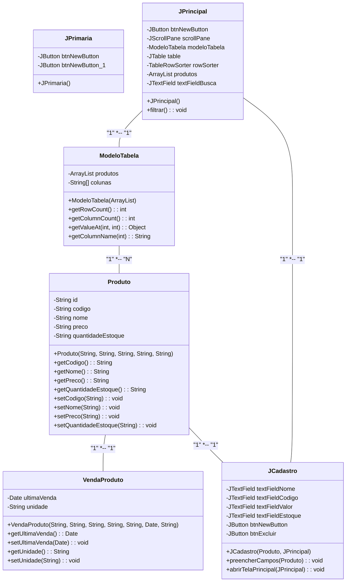

## Diagrama de Classes

```mermaid
classDiagram
  class Produto {
    -String id
    -String codigo
    -String nome
    -String preco
    -String quantidadeEstoque

    +Produto(String, String, String, String, String)
    +getCodigo(): String
    +getNome(): String
    +getPreco(): String
    +getQuantidadeEstoque(): String
    +setCodigo(String): void
    +setNome(String): void
    +setPreco(String): void
    +setQuantidadeEstoque(String): void
  }

  class VendaProduto {
    -Date ultimaVenda
    -String unidade

    +VendaProduto(String, String, String, String, String, Date, String)
    +getUltimaVenda(): Date
    +setUltimaVenda(Date): void
    +getUnidade(): String
    +setUnidade(String): void
  }

  class ModeloTabela {
    -ArrayList<Produto> produtos
    -String[] colunas

    +ModeloTabela(ArrayList<Produto>)
    +getRowCount(): int
    +getColumnCount(): int
    +getValueAt(int, int): Object
    +getColumnName(int): String
  }

  class JCadastro {
    -JTextField textFieldNome
    -JTextField textFieldCodigo
    -JTextField textFieldValor
    -JTextField textFieldEstoque
    -JButton btnNewButton
    -JButton btnExcluir

    +JCadastro(Produto, JPrincipal)
    +preencherCampos(Produto): void
    +abrirTelaPrincipal(JPrincipal): void
  }

  class JPrimaria {
    -JButton btnNewButton
    -JButton btnNewButton_1

    +JPrimaria()
  }

  class JPrincipal {
    -JButton btnNewButton
    -JScrollPane scrollPane
    -ModeloTabela modeloTabela
    -JTable table
    -TableRowSorter<ModeloTabela> rowSorter
    -ArrayList<Produto> produtos
    -JTextField textFieldBusca

    +JPrincipal()
    +filtrar(): void
  }

  Produto -- VendaProduto: "1" *-- "1"
  Produto -- JCadastro: "1" *-- "1"
  ModeloTabela -- Produto: "1" *-- "N"
  JPrincipal -- ModeloTabela: "1" *-- "1"
  JPrincipal -- JCadastro: "1" *-- "1"
```
